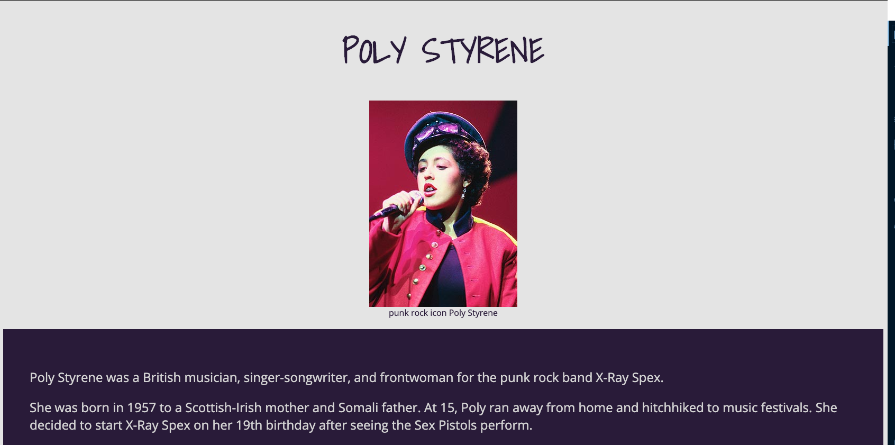

# Poly Styrene

[Poly Styrene Tribute](https://bealearnscode.github.io/poly-styrene-tribute/) is a, you guessed it, tribute page for punk icon and [X-Ray Spex](https://www.x-rayspex.com/) frontwoman, the late  Marianne Joan Elliot-Said, aka Poly Styrene.

I created this little page as part of [Free Code Camp's](https://www.freecodecamp.org/) Responsive Web Design certificate.

## What I Used for This Page

- HTML
- CSS

## What I Like About This Page

- It's about Poly Styrene! Poly is one of my musical icons. A Black girl leading a punk band? Yes, please!

- I used the [ColorZilla](https://www.colorzilla.com/) extension to get the rich, deep purple color for the page. I think the color is beautiful.

- Speaking of colors, I ran my color scheme through [Contrast Checker](https://contrastchecker.com/) and got green stamps across the board.

## Where I Need to Improve

- I'm not crazy about the design, but I know I needed to do something really simple.

- I didn't go into as much detail about my Poly Styrene fangirling, but that can be fixed.

- I want to improve on my floats. I know there are css frameworks the fix these things, but I believe it's still a good skill to have.
